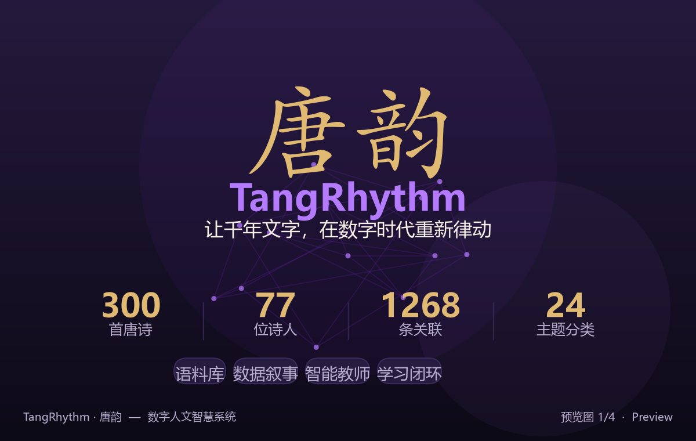
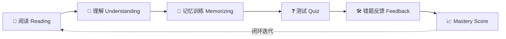
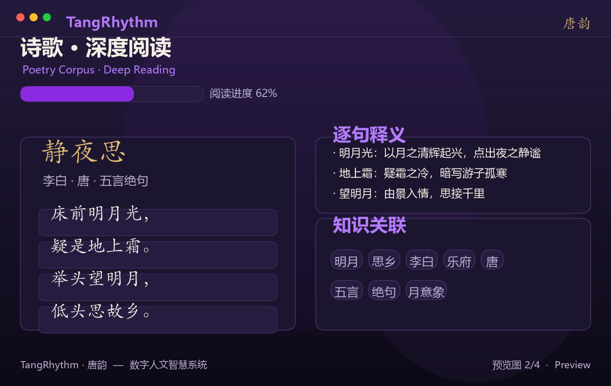
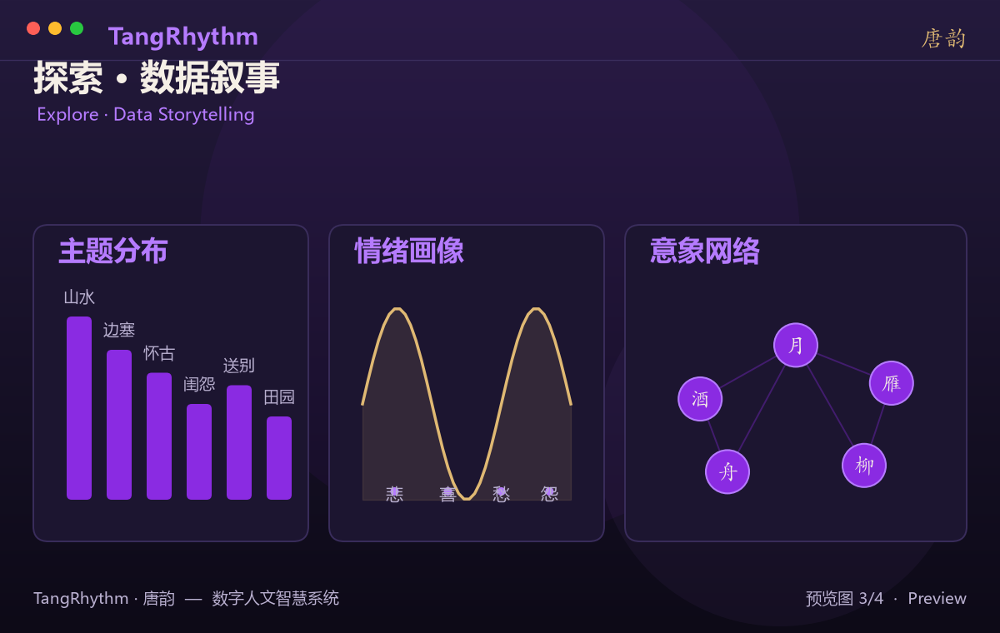
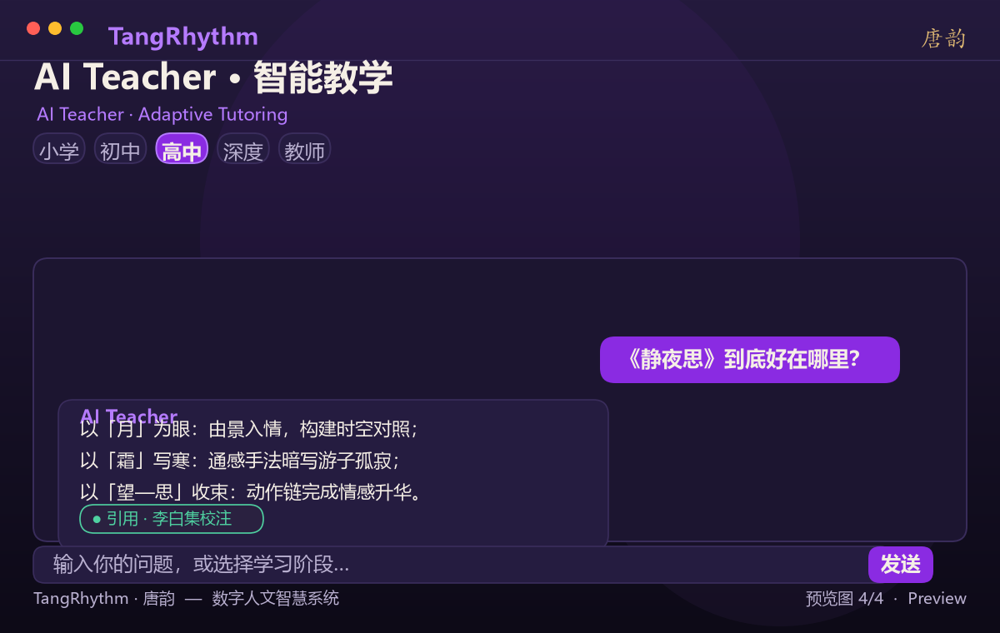
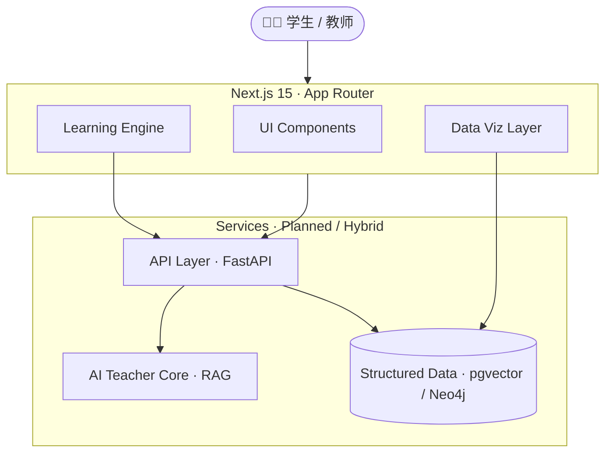

<div align="center">



<br/>


<br/>
<br/>

<h1> 🎐 TangRhythm · 唐韵 </h1>
<h3> 让千年文字，在数字时代重新律动 </h3>

<p>
  <strong>Digital Humanities</strong> · <strong>AI Education</strong> · <strong>Knowledge Graph</strong> · <strong>Data Visualization</strong>
</p>

<p>
  一个以《唐诗三百首》为基石、基于 <b>Next.js 15</b> 构建的唐诗知识宇宙。<br/>
  我们不止于把典籍搬上网页，而是重新设计「人理解经典」的方式——<br/>
  将静态文本，升维为 <b>可探索、可学习、可理解</b> 的数字人文智慧系统。
</p>

<p>
  <a href="#-项目愿景--vision">愿景</a> •
  <a href="#-核心特性--features">特性</a> •
  <a href="#-产品预览--preview">预览</a> •
  <a href="#-技术架构--architecture">架构</a> •
  <a href="#-快速开始--quick-start">开始</a> •
  <a href="#-路线图--roadmap">路线</a>
</p>

<br/>

<p align="center">
  
  
  
  
  
  
  
  
  
</p>

</div>

---

## 📑 目录 · Contents

- [项目初衷 · Vision](#-项目初衷--vision)
- [为什么是 TangRhythm · Why Us](#-为什么是-tangrhythm--why-us)
- [项目数据 · Corpus](#-项目数据--corpus)
- [核心特性 · Features](#-核心特性--features)
- [产品预览 · Preview](#-产品预览--preview)
- [技术架构 · Architecture](#-技术架构--architecture)
- [快速开始 · Quick Start](#-快速开始--quick-start)
- [路线图 · Roadmap](#-路线图--roadmap)
- [贡献指南 · Contributing](#-贡献指南--contributing)
- [许可证 · License](#-许可证--license)

---

## 💫 项目初衷 · Vision

> <b>“我们能否不止把书搬到网页上，而是重新设计人理解经典的方式？”</b>

TangRhythm（唐韵）不是一个普通的古诗词展示网站。它试图回应一个数字人文的时代命题：

**当经典文学遇见现代技术，除了数字化存储，我们还能做什么？**

我们以《唐诗三百首》为基石，构建了一张连接 **诗歌 · 诗人 · 地理 · 意象 · 情感** 的知识图谱；将传统的「读—背—考」单向模式，重构为 **「连接—理解—探索」** 的认知闭环。在这里，每一首诗都不是孤立的文本，而是一个可被检索、可被关联、可被理解的知识节点。

我们相信：**技术的终点不是取代人文，而是让人文被更多人真正看见。**

---

## 🌟 为什么是 TangRhythm · Why Us

在众多古诗网站中，TangRhythm 选择了一条更难、却更有价值的路：

| 维度 | 传统古诗网站 | TangRhythm 唐韵 |
| :--- | :--- | :--- |
| **内容形态** | 线性文本陈列 | 知识图谱驱动的结构化语料 |
| **阅读体验** | 静态浏览 | 逐句释义 + 语义关联网络 |
| **数据价值** | 不可计算 | 主题 / 情绪 / 意象 / 地理多维可分析 |
| **教学范式** | 标准答案灌输 | 分层认知（小学→教师）的思维引导 |
| **学习闭环** | 读完即止 | 阅读 → 记忆 → 测验 → 反馈 → Mastery |
| **工程底座** | 单页静态 | 全栈可扩展（Next.js + 向量检索 + 图谱） |

**TangRhythm 不生产答案，它培养理解力。**

---

## 📊 项目数据 · Corpus

TangRhythm 不只是一行行代码，更是一个**结构化的文学知识底座**——每一份数据都经过建模、关联与可计算化处理。

<div align="center">

| 📚 核心语料 | 👤 诗人网络 | 🌐 语义关系 | 🏷️ 主题维度 |
| :---: | :---: | :---: | :---: |
| **300** 首唐诗 | **77** 位诗人 | **1268** 条关联 | **24** 个主题分类 |

</div>

<div align="center">

> 覆盖初唐至晚唐近三百年文脉 · 平均每位诗人构建 **16+** 条语义关联  
> 数据以「来源可溯源、内容可校验」为第一原则，结构化呈现而非堆砌。

</div>

---

## ✨ 核心特性 · Features

TangRhythm 由四大支柱构成，从语料底座到智能教学，形成完整的数字人文产品矩阵。

### 🎨 01. Poetry Corpus · 语料库
一套真正「可以探索」的唐诗知识底座。我们将诗歌文本转化为结构化对象，让每一次阅读都成为一次发现。

- **📖 深度阅读**：逐句释义、平仄韵脚、结构化呈现，告别 plain text。
- **🔗 知识关联**：一键连接诗人、时代、背景与相关作品，织成语义网络。
- **🔍 智能检索**：基于语义的内容发现，从「找一首诗」到「找一种情绪」。
- **🏛️ 作者宇宙**：以诗人为主线，串联其生平、交游与代表作。

### 🗺️ 02. Explore · 数据叙事
让数据重新讲一遍唐诗。透过数据科学的视角，重新审视文学的内在结构。

- **📊 主题分布**：可视化呈现山水、边塞、怀古、闺怨等文学母题的版图。
- **🧠 情绪画像**：从文本中抽离悲、喜、愁、怨，构建可量化的情绪图谱。
- **🌍 唐诗地图**：从长安到边塞，在地理空间中定位每一首诗的来处与去向。
- **🌌 意象网络**：月、酒、雁、舟——揭示唐诗独有的语义共现与象征体系。

### 🤖 03. AI Teacher · 智能教师
不只是解释答案，而是**教会理解的方法**。基于多模态大模型，构建分层教学模式。

- **🧩 分层教学**：小学 / 初中 / 高中 / 深度 / 教师 五档认知水平自适应。
- **🏛️ 背景融合**：结合历史语境与作者生平，让诗意从时代中自然浮现。
- **💡 思维引导**：从「拟人」到「移情」，搭建可迁移的文学鉴赏框架。
- **📚 引文可溯**：回答附带来源引用，拒绝「一本正经地编造」。

### 📈 04. Learning · 学习闭环
让学习结果「被看见」。构建完整的认知飞轮，把被动阅读转化为主动掌握。

> 阅读 → 理解 → 记忆 → 测试 → 反馈 → Mastery Score



---

## 🖼️ 产品预览 · Preview

<div align="center">

| 🏠 首页 · 知识宇宙入口 | 📖 诗歌 · 深度阅读体验 |
| :---: | :---: |
|  |  |

| 🌐 探索 · 数据可视化 | 🤖 AI Teacher · 智能教学 |
| :---: | :---: |
|  |  |

</div>

---

## 🏗️ 技术架构 · Architecture

TangRhythm 采用现代全栈 Web 架构，在「体验流畅」与「工程可维护」之间追求平衡。前端以 Next.js 15 App Router 构建沉浸式交互，后端预留 FastAPI + PostgreSQL/pgvector + Neo4j 的可扩展数据层。



### 📁 项目结构 · Structure

```text
TangRhythm/
├── app/           # Next.js 页面路由（App Router）
├── components/    # UI 组件库（Oriental Design System）
├── lib/           # 核心逻辑层（检索 / 图谱 / 学习引擎）
├── data/          # 唐诗结构化语料与知识图谱
├── backend/       # 后端服务与 API（FastAPI，可扩展）
├── skills/        # AI 能力模块（分层讲诗 / RAG Pipeline）
└── tests/         # 测试用例与数据校验
```

### ⚙️ 工程亮点 · Engineering Highlights

- **前端优先，优雅降级**：未配置后端时自动回退至本地示例语料，产品永远可运行。
- **检索优先，引用为本**：AI Teacher 在缺失 LLM Key 时进入 retrieval-only 模式，**绝不编造答案**。
- **数据可溯源**：导入脚本保留来源 URL 与 SHA256，将「教育增强内容」与「原文」严格分离。
- **可扩展底座**：词汇检索 + 知识分块 + 向量语义检索（pgvector）平滑衔接，面向生产演进。

---

## 🚀 快速开始 · Quick Start

请确保开发环境已安装 **Node.js LTS** 与 **npm**（推荐 Node 22+）。

### 1. 克隆项目
```bash
git clone https://github.com/Aventardo7777/TangRhythm.git
cd TangRhythm
```

### 2. 安装依赖
```bash
npm install
```

### 3. 启动开发服务器
```bash
npm run dev
```
访问 `http://localhost:3000` 即可进入唐诗知识宇宙。

### 4. 高级配置 · Docker 全栈部署
如需运行完整的后端与 AI Teacher 服务：
```bash
cp backend/.env.example backend/.env
docker compose up --build
```
数据库就绪后导入语料：
```bash
docker compose exec api python scripts/import_tang_poetry.py
```

> **Windows PowerShell 提示**：若脚本执行受限，请在终端运行 `Set-ExecutionPolicy -Scope Process Bypass` 后重试。

---

## 🗓️ 路线图 · Roadmap

TangRhythm 正在持续演进——从语料底座，走向真正的智能。

- [x] **Phase 1 · Corpus**：核心语料库构建与工程骨架。
- [x] **Phase 2 · Knowledge**：知识图谱关系建立与数据层增强（pgvector / FastAPI）。
- [x] **Phase 3 · Product**：完整产品化体验、AI Teacher 与可视化叙事。
- [ ] **Future · Intelligence**：
  - [ ] RAG 知识检索体系增强与多源融合
  - [ ] 动态地理空间交互地图（GIS 级唐诗时空漫游）
  - [ ] 个性化学习路径推荐算法（自适应 Mastery）
  - [ ] 宋词 / 元曲 文学宇宙扩展

---

## 🤝 贡献指南 · Contributing

我们欢迎对数字人文、教育科技、知识图谱感兴趣的开发者与研究者共同参与。

1. **Fork** 本仓库。
2. 创建特性分支：`git checkout -b feature/AmazingFeature`。
3. 提交更改：`git commit -m 'Add some AmazingFeature'`。
4. 推送分支：`git push origin feature/AmazingFeature`。
5. 提交 **Pull Request**。

> 我们尤其欢迎：语料校验、知识图谱补全、可视化创新与教学场景设计。

---

<div align="center">

## 📜 许可证 · License

本项目依据仓库根目录 `LICENSE` 文件进行授权。

---

<br/>

**TangRhythm · 唐韵**

> <b>一卷唐诗，读见千年风华。</b>

Made with ❤️ by [Aventardo7777](https://github.com/Aventardo7777)

</div>
