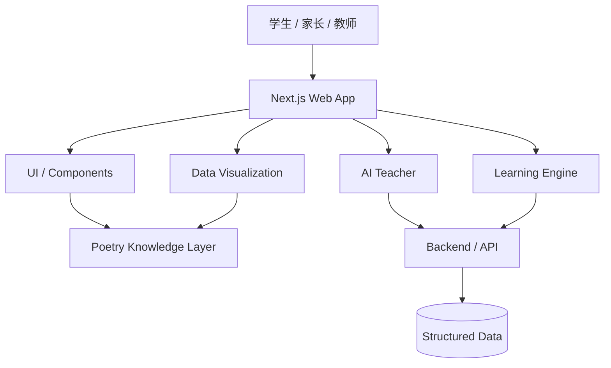

<div align="center">

# TangRhythm · 唐韵

### Digital Humanities · 唐诗知识宇宙 · AI 教学 · Data Visualization

<p>
  <strong>把《唐诗三百首》从静态文本，变成可以搜索、理解、分析、探索与学习的数字知识宇宙。</strong>
</p>

<p>
  <a href="#-项目愿景">项目愿景</a> ·
  <a href="#-核心能力">核心能力</a> ·
  <a href="#-产品体验">产品体验</a> ·
  <a href="#-技术架构">技术架构</a> ·
  <a href="#-快速开始">快速开始</a>
</p>

<p>
  
  
  
  
  
</p>

</div>

---

## ✦ 项目一句话

**TangRhythm（唐韵）不是一个普通的古诗词展示网站。**

它试图回答一个更大的问题：

> **当经典文学进入数字时代，我们能不能不只是“把书搬到网页上”，而是重新设计人理解经典的方式？**

TangRhythm 以《唐诗三百首》为核心语料，把诗歌文本、作者、主题、情绪、意象、地理空间、语义关系、AI 解释与学习行为连接起来，形成一套面向学生、家长与教师的 **Digital Humanities（数字人文）+ AI Education（智能教育）+ Data Visualization（数据可视化）** 体验。

它的目标不是让古诗“更像软件”，而是让软件成为理解古诗的另一种入口。

---

## ✦ 项目数据

| 指标 | 当前规模 | 说明 |
|---|---:|---|
| 诗歌 | **300** | 《唐诗三百首》核心诗歌语料 |
| 诗人 | **77** | 诗人及作者关联信息 |
| 主题 | **24** | 主题维度与内容分类 |
| 语义关系 | **1268** | 诗歌、主题与概念之间的关系 |
| Web 技术栈 | **Next.js 15.4.0** | 现代 React 全栈 Web 框架 |
| TypeScript | **Enabled** | 类型安全与工程化开发 |

> 数据规模与页面展示以当前项目 Phase 3 版本为准。

---

# ✦ 项目愿景

## 从“背诗”走向“理解诗”

传统古诗学习通常围绕三个动作展开：

**读 → 背 → 考。**

而 TangRhythm 希望增加第四个动作：

**连接。**

一首诗不再只是孤立的一段文字，而是一个知识节点：它可以连接诗人、时代、地域、主题、情绪、意象、名句、相似作品与学习路径。

例如，一句“感时花溅泪”，不仅可以解释“拟人”，还可以进一步进入杜甫的时代背景、诗人的情绪状态、景与情之间的关系，以及“移情”在古典诗歌中的表达机制。

TangRhythm 想做的，就是把这些原本散落在教材、注释、课堂和人的经验里的关联，重新组织成一个可探索的数字知识系统。

---

# ✦ 为什么叫 TangRhythm？

**Tang**：唐诗，代表项目最核心的文化语料。

**Rhythm**：节律、韵律，也代表诗歌本身的声音、节奏、情绪与时间感。

所以 TangRhythm 并不只是“唐诗数据库”的意思。

它更像是一种隐喻：

> **让千年前的文字，在今天重新产生可被阅读、理解、连接与学习的节律。**

---

# ✦ 核心能力

## 01 · Poetry Corpus
### 一套真正可以探索的唐诗语料库

TangRhythm 以《唐诗三百首》为核心内容入口，将诗歌由静态文本转化为结构化知识对象。

你可以围绕诗歌进行：

- 全文阅读与逐句理解
- 诗人探索
- 主题关联
- 名句发现
- 内容检索
- 诗歌之间的知识关系探索

目标并不是做一个“诗歌列表”，而是建立一个能够持续扩展的文学知识底座。

---

## 02 · Explore
### 让数据重新讲一遍唐诗

如果我们把诗歌当作数据，会发现文学作品同样可以形成非常迷人的结构。

TangRhythm 将唐诗映射到多个分析维度：

### 主题分布
观察《唐诗三百首》中不同主题的分布，让“山水、离愁、战争、羁旅、怀古”等传统文学概念获得可视化表达。

### 情绪画像
尝试把诗歌中的情绪线索从文本中抽离出来，让“悲、喜、思、愁、怀、怨”等情感成为可以被观察的结构。

### 唐诗地图
从长安到江南，从塞北到江南水乡，让诗歌沿着真实地理空间流动。

文学因此不再只是“读”，也可以被“定位”。

### 意象网络
月、酒、山、水、雁、舟……

这些高频而具有文化意味的意象彼此连接，形成一种属于唐诗自己的语义网络。

---

## 03 · AI Teacher
### 不只是解释，而是教你理解

TangRhythm 的 AI Teacher 设计不是简单接入一个聊天机器人，而是围绕“教学”重新组织回答。

系统希望综合：

**诗歌文本 + 上下文 + 作者资料 + 历史背景 + 学习者年龄 + 学习目标**

再生成更合适的解释方式。

同一首诗，对不同学习阶段的人，不应该只有同一个答案。

因此项目设计了多层教学模式：

| 模式 | 核心目标 |
|---|---|
| 小学模式 | 让孩子先读懂、看见画面与故事 |
| 初中模式 | 建立基础的诗歌鉴赏框架 |
| 高中模式 | 强化意象、手法、结构与情感分析 |
| 深度模式 | 进入文学史、文本细读与跨作品关联 |
| 教师模式 | 提供更适合备课与教学组织的内容 |

### 一个典型示例

> **为什么“感时花溅泪”会把花写得像人在流泪？**

TangRhythm 不停在“这是拟人”的答案上，而进一步解释：诗人的悲痛投射到眼前花鸟之中，景物因此被赋予人的情感，让景与情真正发生融合。

这正是 TangRhythm 与普通诗词问答工具最大的区别之一：

> **解释答案，不如教会理解方法。**

---

# ✦ 学习系统

## 阅读 → 掌握 → 成长

TangRhythm 不希望学习停留在“看完一首诗”。

因此项目进一步构建了学习闭环：

```text
        阅读
         │
         ▼
      理解诗歌
         │
         ▼
      记忆训练
         │
         ▼
      测试与填空
         │
         ▼
      错题反馈
         │
         ▼
    间隔复习 / 巩固
         │
         ▼
    Mastery Score
         │
         └──────────→ 回到学习
```

### Reading
逐句解释、结构化阅读、名句收藏与作者探索。

### Mastery
通过背诵、填空、测试、错题与间隔复习强化长期记忆。

### Growth
通过 **Mastery Score** 观察自己的学习轨迹，而不是只看一次测试成绩。

这意味着古诗词学习被重新理解成一个可以持续迭代的过程。

---

# ✦ 产品体验

## 首页 · 让文学第一次拥有“知识宇宙”的入口

当前首页围绕四条核心产品路径组织：

**诗歌 · 探索 · AI 老师 · 学习**

首页通过数据指标建立项目的第一印象，再逐步进入主题分布、情绪画像、地图、意象网络与 AI Teacher。

核心文案：

> **一卷唐诗，读见千年风华。**

它并不是一句装饰性的 Slogan，而是整个产品体验的设计方向：

**先阅读，再探索；先理解，再学习；从一首诗，进入一个时代。**

---

# ✦ 信息架构

```text
TangRhythm
│
├── Poetry
│   ├── 诗歌浏览
│   ├── 阅读与解释
│   ├── 作者探索
│   └── 作品关系
│
├── Explore
│   ├── 主题分布
│   ├── 情绪画像
│   ├── 唐诗地图
│   └── 意象网络
│
├── AI Teacher
│   ├── 小学模式
│   ├── 初中模式
│   ├── 高中模式
│   ├── 深度模式
│   └── 教师模式
│
└── Learning
    ├── 背诵
    ├── 填空
    ├── 测试
    ├── 错题
    ├── 间隔复习
    └── Mastery Score
```

---

# ✦ 技术架构

TangRhythm 的工程目标不是“能跑就行”，而是尽可能靠近现代 Web 产品的组织方式。



## 当前技术栈

| 层级 | 技术 / 方案 |
|---|---|
| Frontend | **Next.js 15.4.0** |
| Language | **TypeScript** |
| Styling / UI | React / Next.js 组件化体系 |
| Data | 结构化诗歌与知识关系数据 |
| Visualization | Web 可视化体系，可承载主题、情绪、地图、网络等分析视图 |
| AI | AI Teacher 教学层 |
| Backend | 项目内置 backend / API 结构 |
| Deployment / Services | Docker Compose 支持 |
| Quality | tests / typed configuration / modular structure |

---

# ✦ Repository Structure

```text
TangRhythm/
│
├── app/                    # Next.js 应用与页面入口
├── components/             # 可复用 UI 组件
├── lib/                    # 核心逻辑与工具层
├── data/                   # 唐诗与知识数据
├── backend/                # 后端 / API 相关能力
├── docs/                   # 项目文档
├── skills/                 # AI / 项目能力模块
├── tests/                  # 测试
│
├── TangRhythm-Phase3-Overlay/  # Phase 3 增强层
├── APPLY_PHASE3.ps1            # Phase 3 应用脚本
├── PHASE3.md                   # Phase 3 说明
├── package.json
├── next.config.ts
├── tsconfig.json
├── docker-compose.yml
└── README.md
```

---

# ✦ 快速开始

## 1. 环境要求

建议环境：

- Node.js **LTS**
- npm
- Windows / macOS / Linux
- Docker（如需运行 backend 服务）

---

## 2. 克隆项目

```bash
git clone https://github.com/Aventardo7777/TangRhythm.git
cd TangRhythm
```

---

## 3. 安装依赖

```bash
npm install
```

---

## 4. 启动开发环境

```bash
npm run dev
```

浏览器访问：

```text
http://localhost:3000
```

---

## 5. 启动后端服务（可选）

如果需要运行项目后端 / 服务依赖：

```bash
docker compose up --build
```

---

# ✦ Windows / PowerShell 提示

如果 PowerShell 的执行策略阻止脚本运行，可在当前终端会话中使用：

```powershell
Set-ExecutionPolicy -Scope Process Bypass
```

然后再执行项目脚本。

> 该命令只影响当前 PowerShell 进程，不会永久修改系统策略。

---

# ✦ Phase 3

Phase 3 是项目从“内容型网站”向“数字人文产品”进一步升级的重要阶段。

当前 Phase 3 已包括：

- 更完整的首页产品表达
- Poetry 内容入口
- Explore 数据叙事入口
- AI Teacher 产品入口
- Learning 学习闭环表达
- 主题 / 情绪 / 地图 / 意象网络等数字人文方向
- Phase 3 Overlay 的模块化更新方式

Phase 3 的核心思想可以概括为：

> **Content → Knowledge → Visualization → AI → Learning**

也就是让内容逐渐变成知识，让知识变成关系，让关系变成可视化，让可视化进入 AI 教学，再让教学回到学习行为。

---

# ✦ 数字人文价值

TangRhythm 的核心创新，并不是“给唐诗换一个好看的网页”。

它尝试完成的是一次媒介转换：

```text
传统文学
   ↓
数字化文本
   ↓
结构化知识
   ↓
关系网络
   ↓
可视化探索
   ↓
AI 解释与教学
   ↓
个性化学习
```

这意味着同一首诗可以拥有完全不同的进入方式：

**文学入口**：读诗、品句、理解意境。

**数据入口**：主题、情绪、意象、作者、地点。

**AI 入口**：向 AI Teacher 提问。

**教育入口**：背诵、测试、错题、复习、掌握度。

**知识图谱入口**：从一首诗走向另一个诗人、一个主题、一处地理空间或一个意象。

这正是 TangRhythm 想构建的“知识宇宙”。

---

# ✦ 面向谁？

## 学生

让“背过”变成“真正理解”。

从小学启蒙到高中鉴赏，再到更深层次的文学分析，可以根据不同学习阶段切换解释方式。

## 家长

让古诗词学习从单纯监督背诵，变成可以观察、理解与陪伴的学习过程。

## 教师

提供更适合课堂辅助、诗歌解释、知识组织与内容探索的数字工具。

## 文学与数字人文研究者

提供一个进一步实验文学数据化、语义关系、文本分析和可视化呈现的开放式基础。

---

# ✦ 设计原则

### 01 · 经典内容，现代交互

不改变古诗本身的文学价值，但改变用户进入古诗的方式。

### 02 · 数据服务文学，而不是替代文学

可视化不是为了制造“漂亮图表”，而是帮助人看到文本背后的结构。

### 03 · AI 服务理解，而不是代替思考

AI Teacher 的目标不是替学生完成作业，而是帮助学生建立理解框架。

### 04 · 学习结果，应该能够被看见

通过 Mastery Score 等机制，让学习从一次性的完成，变成可观察、可持续的成长。

---

# ✦ Roadmap

> 以下为项目演进方向，不代表所有项目已完成。

### Phase 1 · Corpus

- [x] 核心诗歌语料组织
- [x] 基础内容结构
- [x] 项目工程骨架

### Phase 2 · Knowledge

- [x] 诗歌 / 诗人 / 主题等关系组织
- [x] 项目数据层增强
- [x] 数字人文方向确定

### Phase 3 · Product

- [x] 首页产品化
- [x] Poetry 入口
- [x] Explore 入口
- [x] AI Teacher 入口
- [x] Learning 入口
- [x] 数据叙事与产品视觉统一

### Future · Intelligence

- [ ] 更完整的 RAG 知识检索体系
- [ ] 更细粒度的诗歌语义关系
- [ ] 动态情绪与主题分析
- [ ] 地理空间交互地图增强
- [ ] 意象共现网络动态探索
- [ ] 个性化学习推荐
- [ ] 更完整的掌握度模型
- [ ] 面向教师的备课与课堂工具
- [ ] 多模态 AI 教学体验

---

# ✦ 项目截图

> 建议将真实项目截图放入 `docs/screenshots/`，再替换下面的占位路径。

### 首页


### 唐诗探索


### 数据可视化


### AI Teacher


### 学习系统


---

# ✦ Demo

本地启动：

```text
http://localhost:3000
```

核心页面：

| 页面 | 地址 |
|---|---|
| 首页 | `/` |
| 唐诗 | `/poetry` |
| AI 老师 | `/ai` |
| 探索 | `/#explore` |
| 学习 | `/#learning` |

---

# ✦ Why This Project Matters

互联网已经非常擅长保存信息。

搜索引擎可以找到一首诗，电子书可以展示一首诗，百科可以解释一首诗，AI 也可以回答一首诗。

但这些能力仍然经常是彼此分离的。

**TangRhythm 想做的是把它们重新连接起来。**

让一首诗既是文本，又是知识节点；既能被阅读，又能被探索；既能被解释，又能进入学习系统；既属于唐代，也能够通过数字技术进入今天的教育场景。

所以 TangRhythm 最终想呈现的并不是“三百首诗”。

而是：

> **三百首诗背后，一整套关于中国古典文学的数字知识结构。**

---

# ✦ Contributing

欢迎对 TangRhythm 的数据、文学内容、可视化、AI 教学、工程实现与教育产品设计提出建议或贡献。

建议贡献流程：

```text
git checkout -b feature/your-feature
# make changes
npm test
npm run dev
git commit -m "feat: your feature"
git push origin feature/your-feature
```

欢迎通过 Issue / Pull Request 讨论新的数据模型、交互想法与教学模式。

---

# ✦ License

当前仓库以项目根目录中的 `LICENSE` 文件为准。

如果你计划进一步开放数据集、模型提示词或教学内容，建议为软件代码、文学数据与衍生知识库分别建立清晰的授权边界。

---

<div align="center">

## TangRhythm · 唐韵

**让古诗词不只是被背下来，而是被真正理解。**

`Tang Poetry · AI · Data · Learning`

</div>
